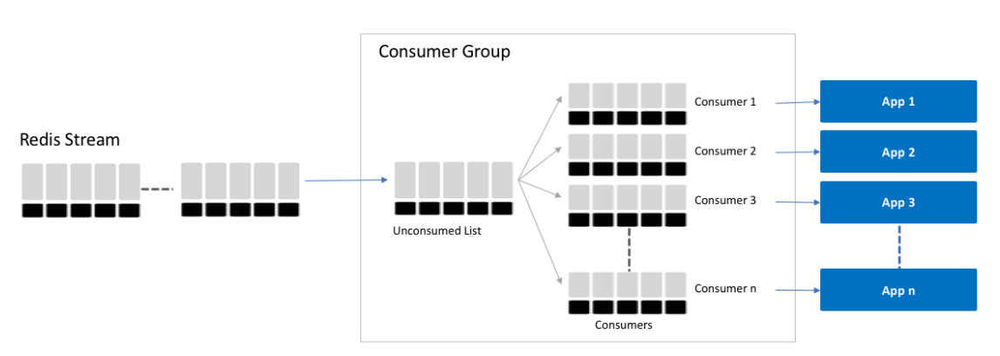

# Test assignment for Moonactive interview

Simple application will consists from two main modules - API and Event Scheduler. 
API implements only two methods allowing adding and removing events.

API will allow JSON RPC calls and perform input validation using JSON Schema.

Both API and Scheduler utilize [Redis Streams](https://redis.io/topics/streams-intro) 
where API pushes new events to the stream and Scheduler consumes events from stream. 
This approach allows us to easily scale Scheduler to several instances, where each instance reads from same group but using different consumer id.
Each event executed at scheduled time and after that committed back to stream. In case of service restart/failure we will read 
any NOT committed events from the beginning of the stream that were previously claimed by this consumer. 


Multiserver simmulation is done using NGINX load balancing. The **very** simple version of load balancer allows us to run predefined amount of API servers 
and access them through NGINX round-robin mechanism.

Detailed project documentation is available [here](doc/documentation.md) (Autogenerated using jsdoc)

### Local installation
Project requires [Node.js](https://nodejs.org/) v10+ to run. and [Docker](https://www.docker.com/) in order to test locally.
- Application can be run as single server and the it will require separately running Redis server. 

- Or it can be runs as multiserver production simulation using included docker-compose. 
In this configuration you will have one Redis server running, two API apps and NGINX server for load balancing between two API servers.

##### Runnning locally as standalone app. 

\* *Environment variables are not required*, application can run with predefined defaults
```sh
$ cd moonactive
$ npm install -d
$ docker-compose -f docker-compose-redis.yml up -d 
$ API_PORT=5000 REDIS_HOST=127.0.0.1 REDIS_PORT=6379 npm start
```

 ##### Runnning locally as production simulation 

```sh
$ cd moonactive
$ npm install -d
$ docker-compose up
```

### Testing application 

Please use attached [Postman](https://www.getpostman.com/) JSON [collection](./postman_collection.json) in order to test API request

```json
{
	"jsonrpc": "2.0", 
	"id": 1,
	"method": "add", 
	"params": {
            "message" : "Test event #1",
            "timestamp" : 1568512450000
        }	
}
```

or by using curl request from command line

```sh
curl --data '{"jsonrpc":"2.0","id":1,"method":"add","params":{"message":"Test event #1","timestamp":1568512450000}}' \
    --header "Content-Type: application/json" \
    --location --request POST http://127.0.0.1:5000/event
```


